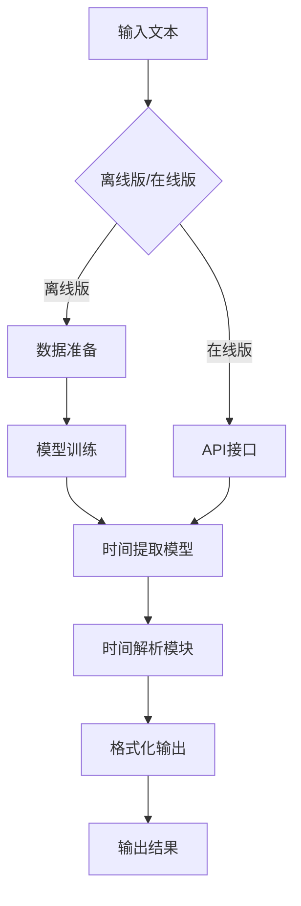

```mermaid
graph TD
    A[输入文本] --> B{离线版/在线版}
    B -->|离线版| C[数据准备]
    B -->|在线版| E[API接口]
    C --> D[模型训练]
    D --> F[时间提取模型]
    E --> F
    F --> G[时间解析模块]
    G --> H[格式化输出]
    H --> I[输出结果]
```