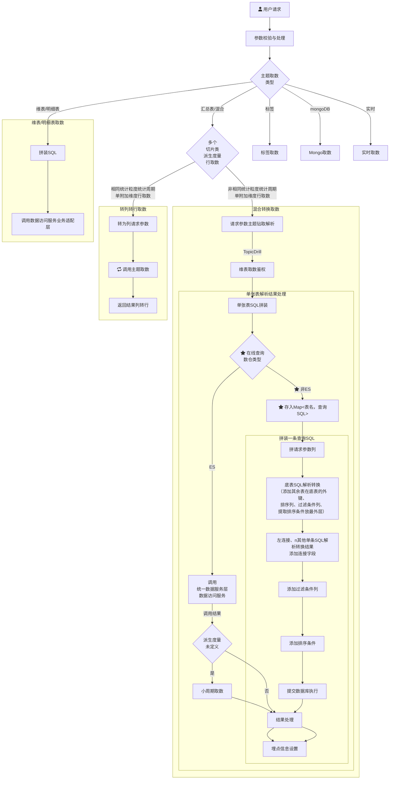

```mermaid
flowchart TD
    A[fa:fa-user 用户请求] -->A1[参数校验与处理] --> B{主题取数\n类型}
    B -->|维表/明细表| D[拼装SQL]
    B -->|汇总表/混合| E{多个\n切片类\n派生度量\n行取数}
    B -->|标签| F[标签取数]
    B -->|mongoDB| G[Mongo取数]
    B -->|实时| H[实时取数]
    E -->|相同统计粒度统计周期\n单附加维度行取数| E1[转为列请求参数]
    E -->|非相同统计粒度统计周期\n单附加维度行取数| T1[请求参数主题钻取解析]
    subgraph 维表/明细表取数
    D-->D1[调用数据访问服务业务适配层]
    end
    subgraph 转列转行取数
    E1-->E11[fa:fa-repeat 调用主题取数]-->E12[返回结果列转行]
    end
    subgraph 混合转换取数
    T1-->|TopicDrill| T2[维表取数鉴权] --> T31[单张表SQL拼装]
        subgraph 单张表解析结果处理
        T31 --> T4{fa:fa-star 在线查询\n数仓类型}-->|ES|T32[调用\n统一数据服务层\n数据访问服务] --> |调用结果|T33{派生度量\n未定义}
        T33 --> |是|T33_1[小周期取数]-->T34[结果处理]-->T35[埋点信息设置]
        T33 --> |否|T34
        T4 --> |fa:fa-star 非ES|T41["fa:fa-star 存入Map<表名，查询SQL>"]
        T41 --> T42[拼请求参数列]
            subgraph 拼装一条查询SQL
            T42 --> M1["底表SQL解析转换\n（添加其余表在底表的外键、\n排序列、过滤条件列、\n提取排序条件放最外层）"] --> M2[左连接、n其他单条SQL解析转换结果\n添加连接字段] --> 添加过滤条件列 --> 添加排序条件 --> 提交数据库执行 --> T34 --> T35
            end
        end
    end
```