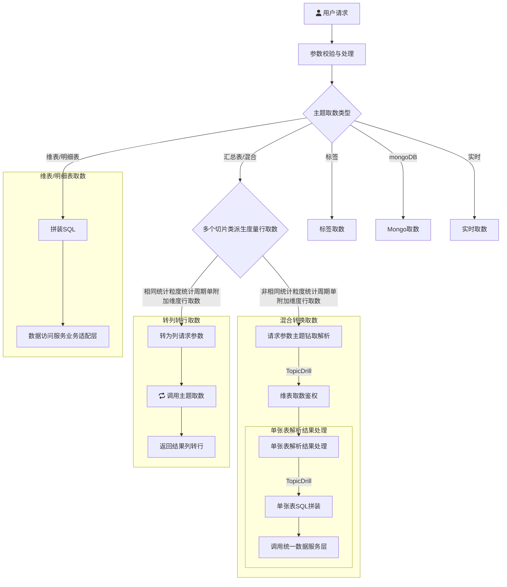

```mermaid
flowchart TD
    A[fa:fa-user 用户请求] -->A1[参数校验与处理] --> B{主题取数类型}
    B -->|维表/明细表| D[拼装SQL]
    B -->|汇总表/混合| E{多个切片类派生度量行取数}
    B -->|标签| F[标签取数]
    B -->|mongoDB| G[Mongo取数]
    B -->|实时| H[实时取数]
    E -->|相同统计粒度统计周期单附加维度行取数| E1[转为列请求参数]
    E -->|非相同统计粒度统计周期单附加维度行取数| T1[请求参数主题钻取解析]
    subgraph 维表/明细表取数
    D-->D1[数据访问服务业务适配层]
    end
    subgraph 转列转行取数
    E1-->E11[fa:fa-repeat 调用主题取数]-->E12[返回结果列转行]
    end
    subgraph 混合转换取数
    T1-->|TopicDrill| T2[维表取数鉴权] --> T3[单张表解析结果处理]

    subgraph 单张表解析结果处理
    T3-->|TopicDrill| T31[单张表SQL拼装] --> T32[调用统一数据服务层]
    end
        end
```